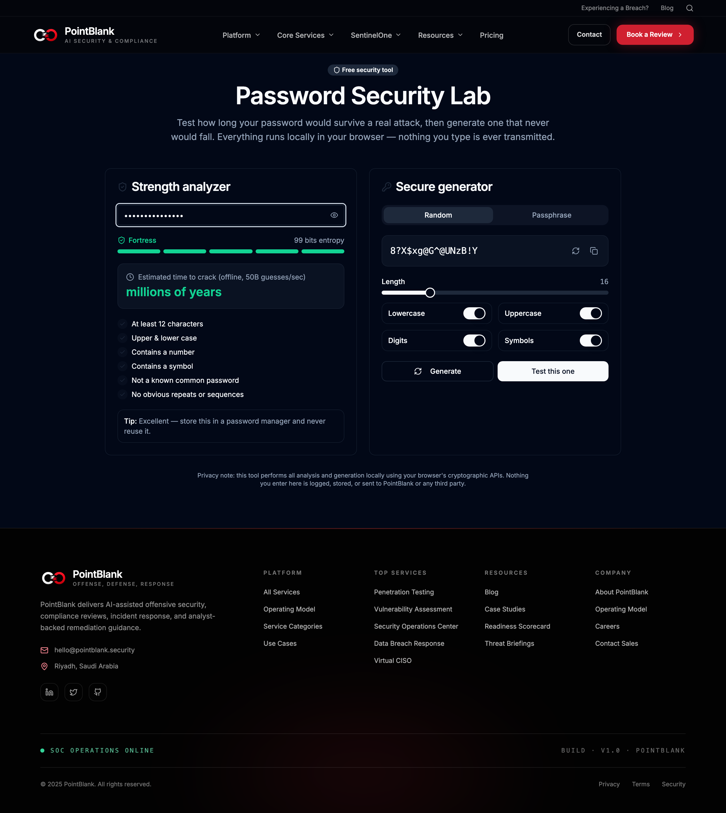
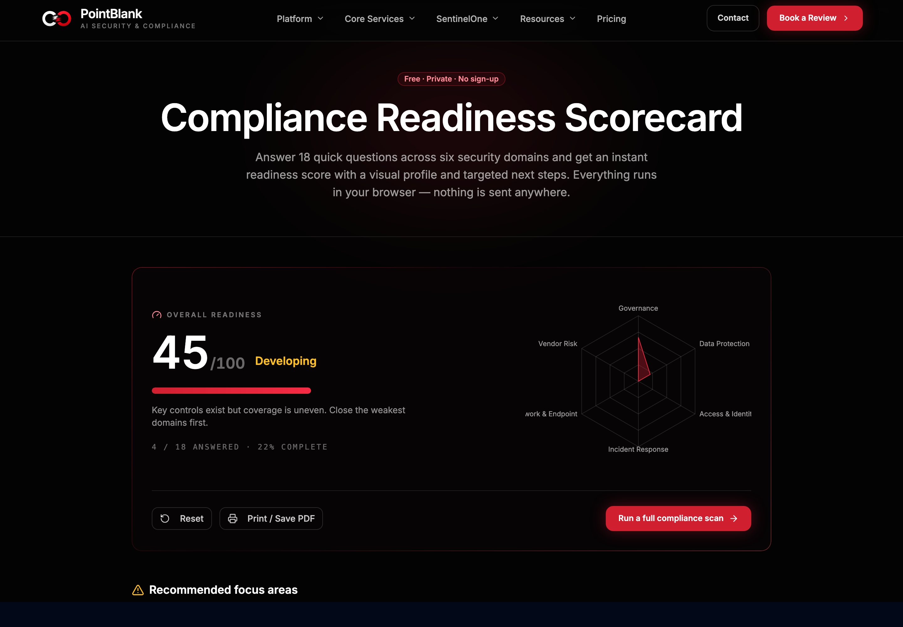
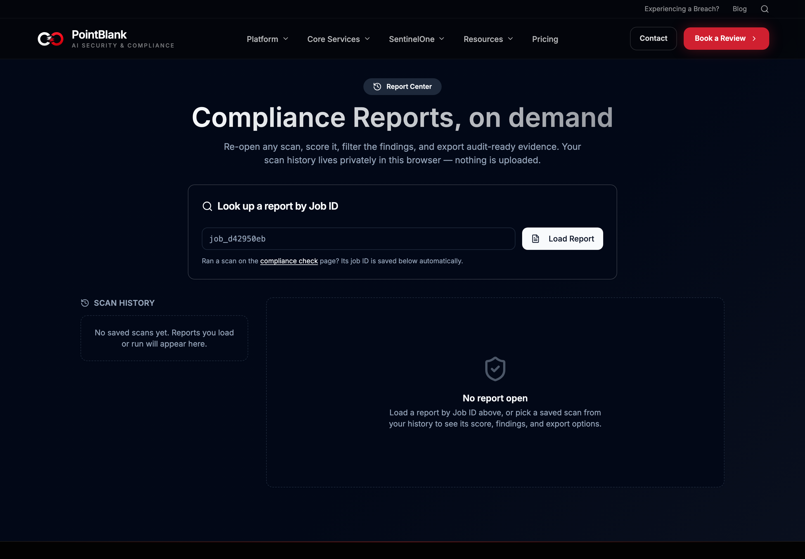
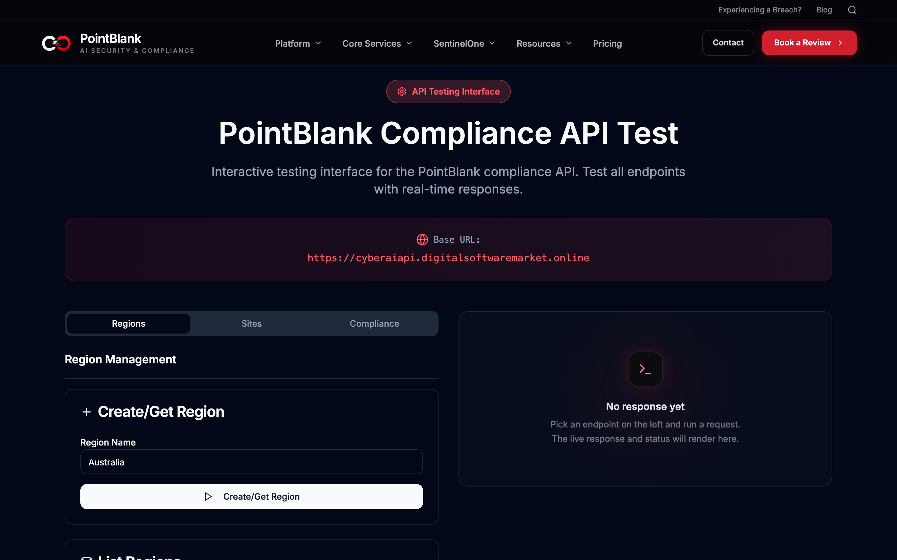
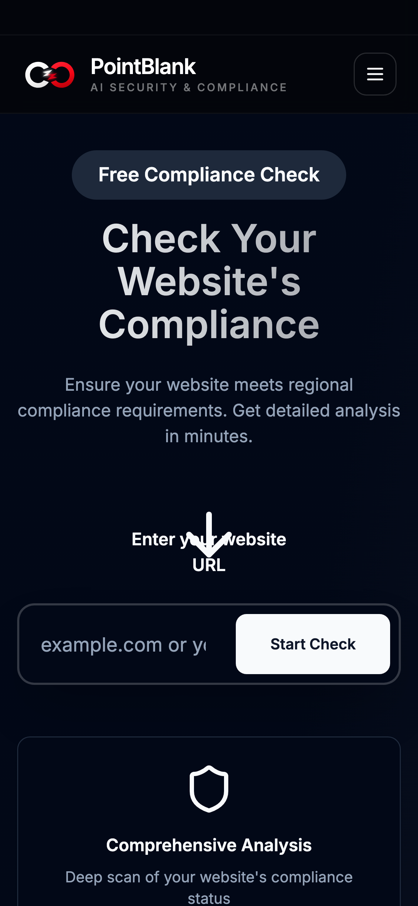
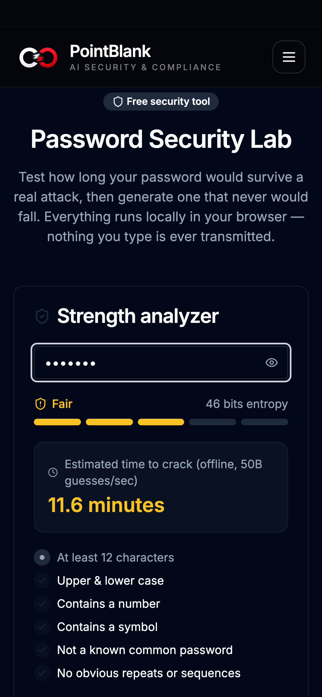
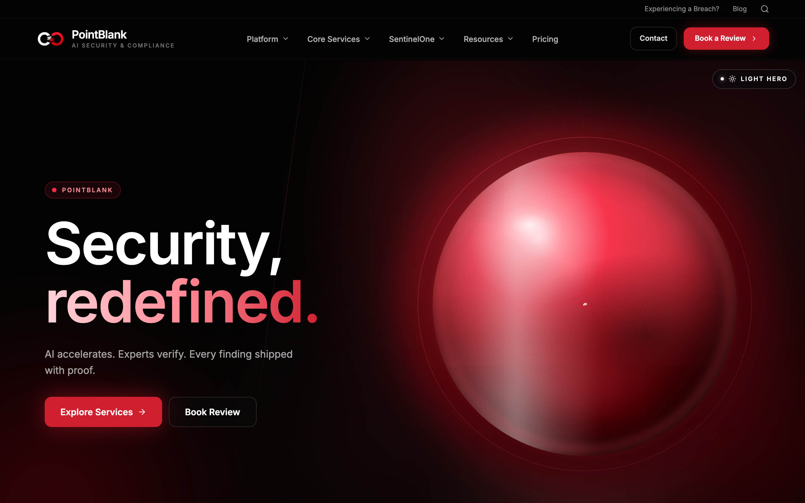
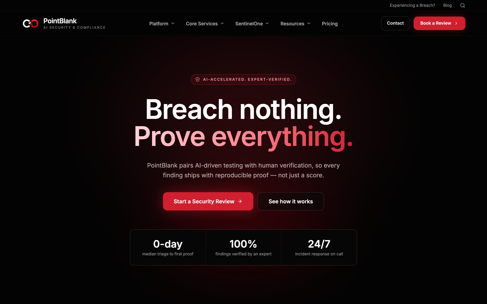

# PointBlank

> AI-assisted security, compliance, and incident response — packed into one fast, unapologetically dark web experience, now with a whole toolbelt of things you can actually *use*.

[](https://cyberai.techrealm.ai)
[](https://vitejs.dev)
[](https://react.dev)
[](https://www.typescriptlang.org)
[](https://tailwindcss.com)
[](#tested-like-we-mean-it)
[](https://pages.cloudflare.com)
[](LICENSE)

PointBlank is a cybersecurity product site **with teeth**. It pairs a cinematic, animated marketing front-end with a growing set of genuinely useful, ship-today security tools — a website compliance workflow, a scored report center, a password lab, and a readiness scorecard — all wired to a live API and hand-assembled from Vite, React, TypeScript and Tailwind. No page-builder lock-in, no mystery-meat config. Just code you can read and hack on.

<p align="center">
  
</p>

<p align="center"><em>Landing → Password Lab → Readiness Scorecard → Report Center → API playground, in one breath.</em></p>

---

## What's new in this release ✨

This round turned a slick landing page into a small, sharp **security toolkit**. Highlights:

- 🔐 **Password Security Lab** (`/security-lab`) — a real strength analyzer with entropy math and an "estimated time to crack" verdict, plus a cryptographically-random password & passphrase generator. **Everything runs locally in your browser — nothing you type is ever transmitted.**
- 🧮 **Compliance Readiness Scorecard** (`/readiness`) — answer 18 quick questions across six security domains and get an instant maturity score, a radar profile, and targeted next steps. Also 100% client-side.
- 🗂️ **Compliance Report Center** (`/reports`) — re-open any scan by Job ID, score it, filter findings, and export **audit-ready** evidence. Your scan history lives privately in `localStorage` — nothing is uploaded.
- 🎯 **A polished scan experience** — an animated radar scan progress view, an at-a-glance compliance **score ring** summary, and syntax-highlighted JSON responses in the API playground.
- 🅰️🅱️ **A/B landing heroes** — ship two hero treatments and test them with a single `?variant=b` query param, no redeploy required.
- ♿ **Accessibility & performance pass** — route-level code-splitting (the landing bundle dropped ~68%), a skip-to-content link, visible keyboard focus rings, `prefers-reduced-motion` support, and lazy-loaded imagery.
- 🧪 **A real test suite** — 64 Vitest unit tests + Playwright smoke tests, wired into CI. See [Tested like we mean it](#tested-like-we-mean-it).
- 🔎 **Discoverable by default** — JSON-LD structured data, a sitemap, a web manifest, and richer social meta.

---

## The toolbelt, in pictures

### 🔐 Password Security Lab — *client-side, paranoid by design*

Type a password and watch the strength meter, entropy count, and crack-time estimate update live. Then let the generator hand you something a botnet would choke on. Nothing leaves the tab.



### 🧮 Compliance Readiness Scorecard — *know where you stand in 90 seconds*

Six domains, eighteen questions, one honest number. The radar chart shows your weak flanks; the next-steps panel tells you where to aim.



### 🗂️ Compliance Report Center — *scans you can revisit and export*

Look up a report by Job ID or pick one from your local history, then score it, filter it, and export audit-ready evidence.



### 🛰️ The API playground — *poke the backend without leaving the browser*

Fire requests, watch the timing, and read **syntax-highlighted** responses.



### 📱 Sharp on a phone, too

The compliance wizard and every tool scale cleanly from a 390px phone to an ultrawide monitor.

<p align="center">
  
  &nbsp;&nbsp;
  
</p>

---

## Two heroes, pick your energy

The landing page ships **two interchangeable hero moods** on top of the A/B variant system, so you can dial the vibe without touching a deploy pipeline.

| | Preview |
| --- | --- |
| **Light hero** — calm, product-forward, instant |  |
| **SideWave hero** — cinematic, WebGL, high-energy |  |
| **Variant B** — outcome-led, centered, proof-first |  |

The immersive/light toggle lives top-right and remembers your choice in `localStorage`. Variant B is a URL flip away → **[`/?variant=b`](https://cyberai.techrealm.ai/?variant=b)**.

---

## Quick start (zero to running in ~2 minutes)

**Prerequisites:** [Node.js](https://nodejs.org/) 18 or newer (npm tags along). Sanity-check with:

```sh
node -v   # should print v18.x or higher
```

**The one-liner** — clone, install, run:

```sh
git clone https://github.com/waleedsworld/cyberai.git && cd cyberai && npm install && npm run dev
```

Prefer to savor it? Same thing, one step at a time:

```sh
# 1. Grab the code
git clone https://github.com/waleedsworld/cyberai.git
cd cyberai

# 2. Install the dependencies
npm install

# 3. Fire up the dev server
npm run dev
```

Vite hands you a local URL (usually `http://localhost:8080`). Open it and you're in. Edits hot-reload instantly — no refresh gymnastics required.

> **New here?** The client-side tools (`/security-lab`, `/readiness`) need **no backend at all** — they run entirely in your browser, so they're the friendliest place to start poking around.

---

## Talking to the backend

The compliance workflow and API playground call a REST backend. The frontend defaults to:

```
https://cyberaiapi.digitalsoftwaremarket.online
```

Point it at your own by dropping a `.env` in the project root:

```sh
# .env
VITE_API_BASE_URL=https://your-backend.example.com
```

No key, no secret, no drama — it's a single public base URL.

---

## Tested like we mean it

The `tests` pass shipped a suite that actually runs on every push:

```sh
npx vitest run        # 64 unit/component tests
npx playwright test   # end-to-end smoke tests (needs `npx playwright install`)
```

CI runs both on GitHub Actions. See [`docs/testing.md`](docs/testing.md) for the lay of the land.

---

## Handy scripts

| Command             | What it does                                           |
| ------------------- | ------------------------------------------------------ |
| `npm run dev`       | Start the Vite dev server with hot reload              |
| `npm run build`     | Produce an optimized production build in `dist/`       |
| `npm run build:dev` | Build in development mode (unminified, easier to read) |
| `npm run preview`   | Serve the production build locally                     |
| `npm run lint`      | Run ESLint across the project                          |
| `npx vitest run`    | Run the unit/component test suite                      |

---

## Project layout

```
src/
├── components/        # Header, Footer, hero variants, marketing sections, UI kit
│   ├── ScanProgress.tsx        # animated radar scan view
│   ├── ScanResultsSummary.tsx  # compliance score-ring summary
│   └── ui/                     # shadcn/ui primitives + json-viewer, empty-state
├── pages/
│   ├── Index.tsx              # the landing page (+ A/B + hero-mode toggle)
│   ├── ComplianceCheck.tsx    # region → laws → scan → scored report wizard
│   ├── ComplianceReports.tsx  # the Report Center (NEW)
│   ├── ReadinessScorecard.tsx # the readiness scorecard (NEW)
│   ├── SecurityLab.tsx        # the password lab (NEW)
│   ├── ApiTest.tsx            # the API playground
│   ├── ServicePage.tsx        # per-service detail pages
│   └── NotFound.tsx           # a premium, terminal-styled 404
├── data/              # navigation, services, readiness content
├── hooks/             # auth, mobile, scroll animation, toasts, compliance history, A/B variant
└── lib/               # api-base, compliance-report scoring, report-center, url helpers
```

---

## Live demo

Poke at the real thing: **[cyberai.techrealm.ai](https://cyberai.techrealm.ai)**

- Landing → [cyberai.techrealm.ai](https://cyberai.techrealm.ai) &nbsp;·&nbsp; Variant B → [`/?variant=b`](https://cyberai.techrealm.ai/?variant=b)
- Password Lab → [`/security-lab`](https://cyberai.techrealm.ai/security-lab)
- Readiness Scorecard → [`/readiness`](https://cyberai.techrealm.ai/readiness)
- Report Center → [`/reports`](https://cyberai.techrealm.ai/reports)
- Compliance workflow → [`/compliance-check`](https://cyberai.techrealm.ai/compliance-check)
- API playground → [`/api-test`](https://cyberai.techrealm.ai/api-test)

---

## The stack (nothing exotic, everything modern)

- **Vite 5** — instant dev server, snappy production builds
- **React 18 + TypeScript** — typed components, predictable state
- **Tailwind CSS** + **shadcn/ui** (Radix UI) — the design system
- **React Router 6** — client-side routing, code-split per route
- **TanStack Query** — data fetching and caching
- **Vitest + Playwright** — unit, component, and e2e coverage
- **lucide-react** + **recharts** — icons and the readiness radar

---

## License

Released under the [MIT License](LICENSE) — Copyright © 2025 Waleed Ajmal. Point it at your own backend, restyle it, ship it — just keep the notice around.

Stay sharp out there. 🎯
