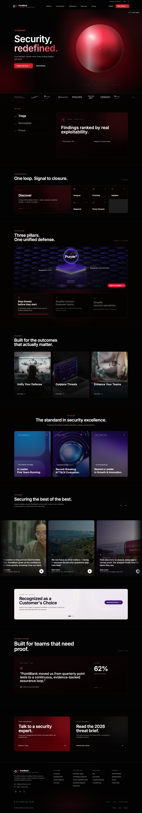
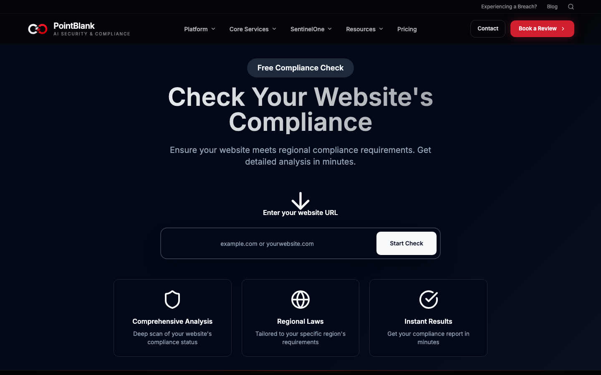
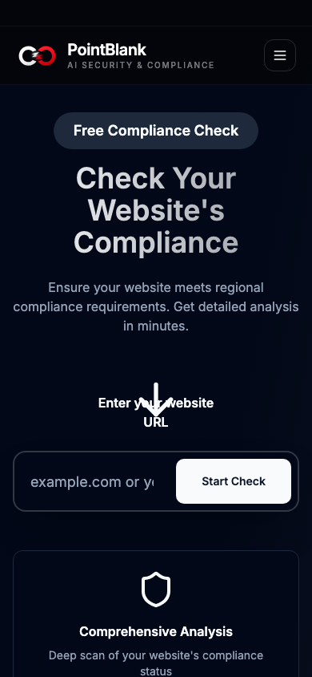
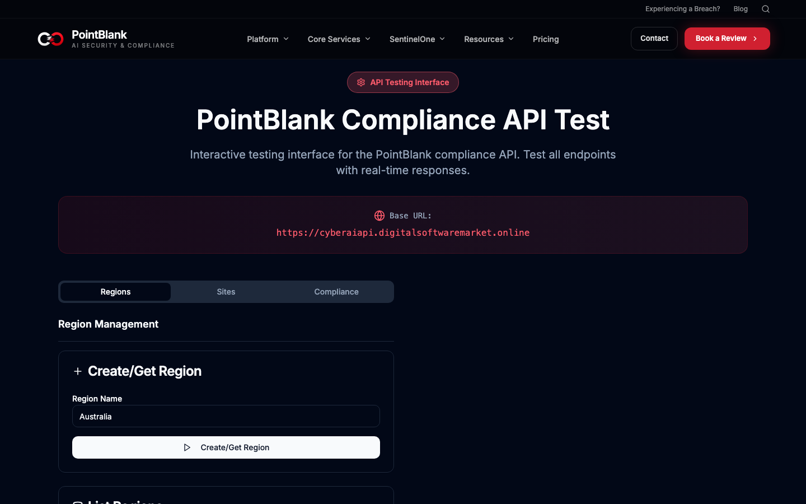

# PointBlank

> AI-assisted security, compliance, and incident response — packed into one fast, unapologetically dark landing experience.

PointBlank is a cybersecurity product site with teeth. It pairs a cinematic, animated marketing front-end with a genuinely useful **website compliance workflow**: pick a region → pull the applicable laws → scan your URLs → get an evidence-backed report. There's also a built-in **API playground** so you can poke the backend without leaving the browser.

No page-builder lock-in, no mystery-meat config — just Vite, React, TypeScript and Tailwind, hand-assembled and ready to hack on.



---

## Why it's cool

- **Two hero moods, one toggle.** A high-energy animated "SideWave" hero, or a calmer light hero — your visitors' choice, remembered in `localStorage`.
- **A real compliance tool, not a mockup.** The `/compliance-check` flow walks through region → laws → URL confirmation → scan → findings, talking to a live API and polling jobs until the report lands.
- **Built-in API playground.** `/api-test` lets you fire requests at the backend and inspect responses — handy for debugging and demos.
- **Genuinely responsive.** Headlines, grids and the compliance wizard scale cleanly from a 390px phone to an ultrawide monitor.
- **Accessible, componentised UI.** Built on Radix primitives + shadcn/ui, so keyboard nav and focus states come for free.

---

## The stack (nothing exotic, everything modern)

- **Vite 5** — instant dev server, snappy production builds
- **React 18 + TypeScript** — typed components, predictable state
- **Tailwind CSS** + **shadcn/ui** (Radix UI) — the design system
- **React Router** — client-side routing across the marketing + tool pages
- **TanStack Query** — data fetching and caching
- **lucide-react** — the icon set

---

## Quick start (from zero to running in ~2 minutes)

**Prerequisites:** [Node.js](https://nodejs.org/) 18 or newer (which brings `npm` along for the ride). Check with:

```sh
node -v   # should print v18.x or higher
```

**1. Grab the code**

```sh
git clone https://github.com/waleedsworld/cyberai.git
cd cyberai
```

**2. Install the dependencies**

```sh
npm install
```

**3. Fire up the dev server**

```sh
npm run dev
```

Vite will hand you a local URL (usually `http://localhost:8080`). Open it and you're in. Edits hot-reload instantly — no refresh gymnastics required.

---

## Talking to the backend

The compliance workflow and API playground call a REST backend. The frontend defaults to:

```
https://cyberaiapi.digitalsoftwaremarket.online
```

Want to point at your own backend? Set an env var at build time — drop a `.env` file in the project root:

```sh
# .env
VITE_API_BASE_URL=https://your-backend.example.com
```

No key, no secret, no drama — it's a single public base URL.

---

## Handy scripts

| Command             | What it does                                           |
| ------------------- | ------------------------------------------------------ |
| `npm run dev`       | Start the Vite dev server with hot reload              |
| `npm run build`     | Produce an optimized production build in `dist/`       |
| `npm run build:dev` | Build in development mode (unminified, easier to read) |
| `npm run preview`   | Serve the production build locally                     |
| `npm run lint`      | Run ESLint across the project                          |

---

## A look around

**The compliance workflow — region, laws, scan, report:**



**Looks just as sharp on a phone:**

<p align="center">
  
</p>

**The built-in API playground:**



---

## Project layout

```
src/
├── components/        # Header, Footer, hero variants, marketing sections, UI kit
│   └── ui/            # shadcn/ui primitives (button, card, dialog, …)
├── pages/
│   ├── Index.tsx           # the landing page
│   ├── ComplianceCheck.tsx # the region → laws → scan → report wizard
│   ├── ApiTest.tsx         # the API playground
│   ├── ServicePage.tsx     # per-service detail pages
│   └── NotFound.tsx        # a friendly 404
├── data/              # navigation + services content
├── hooks/             # auth, mobile detection, scroll animation, toasts
└── lib/               # api-base + shared utilities
```

---

## Live demo

Live demo — deploying soon.

---

## License

Released under the MIT License. Point it at your own backend, restyle it, ship it — just keep the notice around.

Stay sharp out there. 🎯
